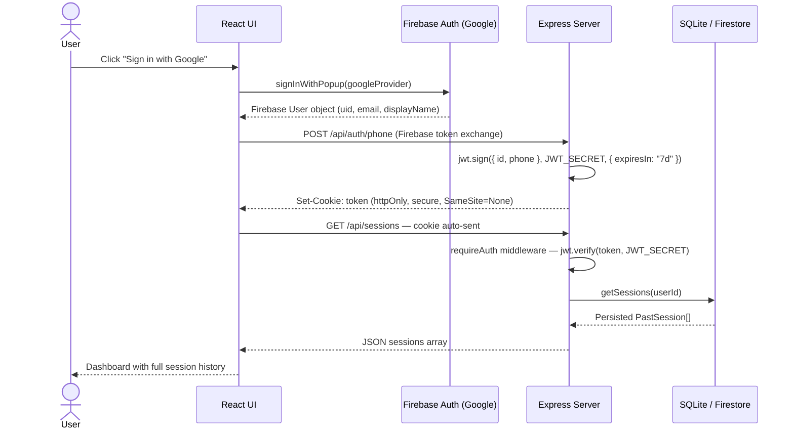
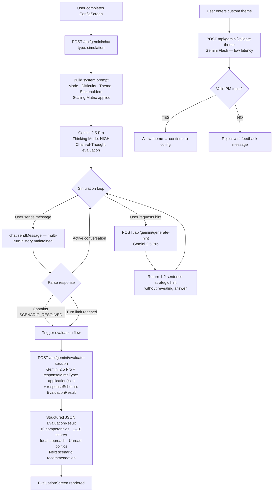

# PM Scenario Lab 🧠

> **Active PM interview training — not passive prep.**
> An AI-powered simulator that puts you in realistic product management situations, roleplays adversarial stakeholders with hidden agendas via Gemini 2.5 Pro, and delivers a brutally honest 10-dimension competency evaluation at the end.

<div align="center">

[](https://ai.studio/apps/12109808-67c4-4026-8f06-8cb95ee13aea?fullscreenApplet=true)
[](#)
[](#)
[](https://react.dev)
[](https://www.typescriptlang.org/)
[](https://ai.google.dev/)
[](https://firebase.google.com/)
[](https://github.com/yatinbhalla/PM-Scenario-Lab/commits/main)

> 🎯 **8.5/10 average satisfaction score** · validated by **20 beta users** · shipped in **1 weekend**, refined in **1 week**

**[ Live App ](https://ai.studio/apps/12109808-67c4-4026-8f06-8cb95ee13aea?fullscreenApplet=true)** · **[ Report Issue ](https://github.com/yatinbhalla/PM-Scenario-Lab)** · **[ Author ](https://github.com/yatinbhalla)**


> _Demo GIF and screenshots coming soon — open an issue if you'd like to contribute one._

</div>

---

## 📋 Table of Contents

- [Overview](#-overview)
- [Key Features](#-Key-Features)
- [Tech Stack](#-tech-stack)
- [Project Layout](#-project-layout)
- [Auth & Login Flow](#-auth--login-flow)
- [Application State](#-application-state)
- [Pages](#-pages)
- [Components](#-components)
- [AI Engine & Routing](#-ai-engine--routing)
- [Simulation Modes](#-simulation-modes)
- [PM Frameworks Covered](#-pm-frameworks-covered)
- [Getting Started](#-getting-started)
- [Known Limitations](#-known-limitations)
- [Contributing](#-contributing)
- [Author](#author)

---

## 🚀 Overview

Most PM prep is passive: read a framework, watch a video, hope you remember it under pressure. **PM Scenario Lab** flips that.

Engineered a full-stack AI simulation platform that **achieved an 8.5/10 average satisfaction score as measured by 20 beta users** by integrating Gemini 2.5 Pro (thinking mode: HIGH) to generate infinite, dynamically-personalized PM scenarios — complete with adversarial stakeholders, hidden political agendas, and a structured 10-competency evaluation engine that outputs exactly where your reasoning breaks down.

Built for PM candidates at FAANG-tier and high-growth companies who want to walk into their interview having already navigated the ambiguity — not just having read about it.

---

## ⚙️ Key Features

- **Architected an adversarial stakeholder simulation engine** that dynamically generates 2–5 stakeholders per scenario — each with a public stance and a hidden agenda — scaling in complexity across 4 difficulty tiers (Beginner → Expert).
- **Engineered 3 distinct simulation modes** (Quick Rep, Meeting Room, End-to-End lifecycle) to match every stage of PM interview preparation, from rapid framework practice to full product lifecycle roleplay.
- **Integrated Gemini 2.5 Pro with thinking mode (HIGH)** and server-side Chain-of-Thought evaluation to assess user responses across 10 PM competencies, outputting a structured JSON `EvaluationResult` with ideal approach, missed politics, and next-scenario recommendations.
- **Shipped an AI Mentor overlay** that generates in-session strategic hints via a secondary Gemini call — guiding users without revealing the answer, surfacing the mental model they're missing in the moment.
- **Productionized a structured feedback loop** (Your Approach vs. Ideal Approach, Unread Politics, Alternative Strategic Paths) that surfaces not just what you did wrong, but the exact phrasing a top-tier PM would have used.
- **Validated custom theme input** with a Gemini Flash classifier to allow open-ended scenario themes (AI regulation, climate fintech, health-tech, etc.) while rejecting off-topic inputs — keeping the sim grounded.
- **Implemented session persistence** via SQLite (server-side) and Firebase Firestore (client-side) so users can pause mid-simulation and resume from the exact conversation state without losing context.
- **Reduced context loss across long simulations** via Lifecycle Memory Pruning — Gemini generates a dense decision summary at each phase boundary, maintaining scenario coherence across 20+ turns.

---

## 🛠 Tech Stack

**Frontend**

[](https://react.dev)
[](https://www.typescriptlang.org/)
[](https://tailwindcss.com/)
[](https://vitejs.dev/)
[](https://www.framer.com/motion/)
[](https://recharts.org/)
[](https://lucide.dev/)

**Backend**

[](https://nodejs.org/)
[](https://expressjs.com/)
[](https://github.com/privatenumber/tsx)

**AI / ML**

[](https://ai.google.dev/)
[](https://www.npmjs.com/package/@google/genai)

**Auth & Identity**

[](https://firebase.google.com/)
[](https://jwt.io/)

**Database**

[](https://github.com/WiseLibs/better-sqlite3)
[](https://firebase.google.com/docs/firestore)

---

## 🗂 Project Layout

<details>
<summary><strong>Expand file tree</strong></summary>

```
PM-Scenario-Lab/
├── src/
│   ├── components/
│   │   ├── ConfigScreen.tsx        # Simulation configurator: mode, difficulty, theme, stakeholders
│   │   ├── Dashboard.tsx           # Session history, resume, and past evaluation viewer
│   │   ├── EvaluationScreen.tsx    # Post-session competency breakdown + ideal approach diff
│   │   ├── LoginScreen.tsx         # Google OAuth gate (Firebase Auth)
│   │   └── SimulationScreen.tsx    # Live multi-turn AI chat with stakeholders + mentor overlay
│   ├── services/
│   │   ├── db.ts                   # SQLite CRUD — getSessions / saveSession by userId
│   │   └── gemini.ts               # Client-side proxy to Express Gemini routes; error handling
│   ├── App.tsx                     # Screen state machine + Firebase auth guard
│   ├── firebase.ts                 # Firebase Auth + Firestore init; Google OAuth helpers
│   ├── index.css                   # Tailwind base + custom design tokens
│   ├── main.tsx                    # React entry point
│   └── types.ts                    # Shared TypeScript interfaces (AppMode, EvaluationResult, etc.)
├── server.ts                       # Express server — API routes, Gemini proxy, Vite middleware
├── vite.config.ts                  # Vite + React + Tailwind plugin config
├── package.json
└── .env.local                      # GEMINI_API_KEY, JWT_SECRET (required — not committed)
```

</details>

---

## 🔐 Auth & Login Flow



**Session security:** JWT cookies are `httpOnly`, `secure`, and `SameSite=None` — inaccessible to JavaScript and CSRF-resistant. Tokens expire after 7 days. Firebase Auth state is observed client-side via `onAuthStateChanged` and drives the top-level auth guard in `App.tsx`.

---

## 🧩 Application State

`App.tsx` owns all screen-level state as a flat state machine — no global context providers or external stores. State is lifted to the top level and passed as props to each screen component.

| State variable | Type | Purpose |
|---|---|---|
| `currentScreen` | `'dashboard' \| 'config' \| 'simulation' \| 'evaluation'` | Controls which screen renders |
| `config` | `SimulationConfig \| null` | Active simulation configuration |
| `evaluation` | `EvaluationResult \| null` | Result from the just-completed session |
| `selectedPastEvaluation` | `EvaluationResult \| null` | Past session loaded from history |
| `resumeSession` | `PastSession \| null` | Carries Gemini chat history when resuming |
| `user` | `firebase/auth User \| null` | Auth state; null routes to `LoginScreen` |
| `isLoadingAuth` | `boolean` | Blocks render until `onAuthStateChanged` resolves |

**State transitions:**
- `startConfig()` → clears `resumeSession`, routes to `config`
- `startSimulation(config)` → sets `config`, routes to `simulation`
- `handleResumeSimulation(session)` → restores `config` + `resumeSession`, routes to `simulation`
- `finishSimulation(result)` → sets `evaluation`, routes to `evaluation`
- `viewPastEvaluation(result)` → sets `selectedPastEvaluation`, routes to `evaluation`
- `returnToDashboard()` → resets all state, routes to `dashboard`

---

## 🗺️ Pages

| Screen | Route / Trigger | Purpose | Key Components |
|---|---|---|---|
| **Login** | `user === null` | Google OAuth entry gate | `LoginScreen` → `signInWithGoogle()` |
| **Dashboard** | `currentScreen === 'dashboard'` | Session history, resume, past evaluations | `Dashboard` → history list, score cards |
| **Config** | `currentScreen === 'config'` | Configure mode, difficulty, theme, time pressure, stakeholders | `ConfigScreen` → `SimulationConfig` |
| **Simulation** | `currentScreen === 'simulation'` | Live multi-turn AI chat; mentor overlay; turn tracking | `SimulationScreen` → `SimulationConfig`, `PastSession` |
| **Evaluation** | `currentScreen === 'evaluation'` | Competency breakdown, approach diff, next recommendation | `EvaluationScreen` → `EvaluationResult` |

---

## 🧩 Components

| Component | Domain | Purpose |
|---|---|---|
| `LoginScreen.tsx` | Auth | Renders Google sign-in; calls `signInWithGoogle()`; displays error state |
| `Dashboard.tsx` | Navigation | Displays session history with status chips; triggers resume, new sim, and past eval view |
| `ConfigScreen.tsx` | Configuration | Multi-step form for `AppMode`, `Difficulty`, `ThemeFocus`, time pressure toggle, custom stakeholder list |
| `SimulationScreen.tsx` | Core | Multi-turn chat UI with AI; tracks turn count vs. max turns; surfaces mentor hint overlay; fires `[SCENARIO_RESOLVED]` detection; auto-saves session state |
| `EvaluationScreen.tsx` | Feedback | Renders `EvaluationResult`: overall score, executive summary, approach diff, `CompetencyScore[]` breakdown (Recharts), alternative paths, next-step recommendation |

---

## 🤖 AI Engine & Routing

### Architecture



### Prompt Design

The simulation system prompt implements a **Scaling Matrix** that adjusts stakeholder count and hidden problem density by difficulty:

| Difficulty | Stakeholders | Hidden Problems | Stakeholder Dynamics |
|---|---|---|---|
| Beginner | 2 | 1–2 linked second-order issues | None |
| Intermediate | 3 | 2–3 linked issues | Mild friction between 2 |
| Advanced | 4 | 3–4 linked issues | Active KPI conflict |
| Expert | 5+ | 4+ severe issues (legal, churn, PR) | Hostile, complex agendas |

**Model routing:**
- `gemini-3.1-pro-preview` (thinking HIGH) — simulation chat, evaluation, hint generation
- `gemini-3-flash-preview` — theme validation (fast, lightweight)

**Fallback handling:** All Gemini routes are wrapped with typed error handling (`GeminiAPIError`) that classifies failures as `RATE_LIMIT`, `INVALID_REQUEST`, `NETWORK`, or `UNKNOWN` and surfaces user-facing messages accordingly. Theme validation defaults to `true` on failure so it never blocks the user flow.

### Evaluation Output Schema

The evaluation endpoint uses Gemini's structured output (`responseMimeType: "application/json"` + `responseSchema`) to guarantee a typed `EvaluationResult`:

| Field | Type | Description |
|---|---|---|
| `overallScore` | `number` | Average across all competency scores (1–10) |
| `executiveSummary` | `string` | 2–3 sentence blunt verdict: would you survive this meeting? |
| `yourApproach` | `string` | What you actually did |
| `idealApproach` | `string` | Exact approach + phrasing a top-tier PM would have used |
| `unreadPolitics` | `string` | Stakeholder hidden agendas you missed |
| `alternativeStrategicPaths` | `string[]` | 1–2 out-of-the-box options you didn't consider |
| `targetedAreasForImprovement` | `string[]` | 1–2 specific behavioral gaps to fix immediately |
| `thinkingToInvoke` | `string` | Mental model or PM framework to apply next time |
| `competencyBreakdown` | `CompetencyScore[]` | Score + one-line justification per competency |
| `actionableNextStep` | `string` | Exact next scenario config to practice your biggest gap |

---

## 🎮 Simulation Modes

| Mode | ID | Description | Best For |
|---|---|---|---|
| **Quick Rep** | `quick_rep` | Single focused scenario — one problem, one stakeholder cluster | Daily reps, rapid framework practice |
| **Meeting Room** | `meeting_room` | Multi-party stakeholder debate — navigate competing KPIs in real time | Stakeholder management, negotiation skills |
| **End-to-End** | `end_to_end` | Full product lifecycle with phase transitions (Discovery → Alignment → Execution) | Senior PM prep, full interview simulation |

All modes support: time pressure toggle · custom stakeholder injection · mentor hint overlay · session resume.

---

## 📐 PM Frameworks Covered

| Framework | Use Case | Scenario Types |
|---|---|---|
| RICE | Prioritization scoring | Prioritization, Trade-offs |
| ICE | Feature ranking | Product Design, Prioritization |
| HEART | Metrics definition | Metrics & Diagnosis |
| North Star | Strategic vision | Product Design, GTM |
| Jobs-to-be-Done | User research framing | Product Design |
| AARRR (Pirate Metrics) | Growth funnel analysis | Metrics & Diagnosis, GTM |
| MoSCoW | Scope management | Prioritization, Go-to-Market |

Frameworks are surfaced **in-context** during the simulation so you can reference them without leaving the flow.

---

## 🚀 Getting Started

**Prerequisites:** Node.js 18+, a Google Gemini API key, a Firebase project (Auth + Firestore enabled).

```bash
# 1. Clone
git clone https://github.com/yatinbhalla/PM-Scenario-Lab.git
cd PM-Scenario-Lab

# 2. Install dependencies
npm install

# 3. Configure environment
```

<details>
<summary><strong>Required environment variables (.env.local)</strong></summary>

```env
GEMINI_API_KEY=your_gemini_api_key_here
JWT_SECRET=your_jwt_secret_here         # any long random string

# Firebase config lives in firebase-applet-config.json (not committed)
# Copy your Firebase project config there — format:
# {
#   "apiKey": "...",
#   "authDomain": "...",
#   "projectId": "...",
#   "firestoreDatabaseId": "..."
# }
```

</details>

```bash
# 4. Run in development (Vite + Express unified server)
npm run dev
# → http://localhost:3000

# 5. Build for production
npm run build
npm start
```

**Getting a Gemini API key:** [Google AI Studio → Get API key](https://aistudio.google.com/app/apikey) — the free tier is sufficient for local development.

---

## ⚠️ Known Limitations

- **No multi-user leaderboard or cohort analytics** — weakness tracking is per-session, not aggregated across a user base; a shared score dashboard is a natural v2 feature.
- **SQLite is local-only** — session persistence doesn't survive container restarts or serverless deployments; a hosted DB migration (Postgres, PlanetScale) is the production upgrade path.
- **Gemini rate limits** — Expert-mode scenarios with thinking mode (HIGH) are token-intensive; sustained usage on free-tier keys will hit quota. The error handler classifies and surfaces this cleanly, but there's no retry queue or backoff yet.
- **No export-to-PDF** — evaluation reports are viewable in-app only; shareable PDF output is on the v2 roadmap.
- **Firebase config is local** — `firebase-applet-config.json` is expected at the project root; a proper secrets manager (GCP Secret Manager, Vault) is the production path.
- **Gemini model IDs are hardcoded** — `gemini-3.1-pro-preview` / `gemini-3-flash-preview` are pinned in `server.ts`; model upgrades require a code change.

**v2 roadmap:** hosted Postgres for cross-device sync · PDF export of evaluation reports · cohort leaderboard for team prep · LangSmith tracing for prompt observability · one-click Vercel/Railway deploy.

---

## 🤝 Contributing

PM Scenario Lab is an open project and I'd love your input — whether that's a new scenario theme, a tighter evaluation rubric, a UX improvement, or a bug catch.

**To contribute:**
1. **Open an Issue** — describe the scenario, feature, or bug clearly.
2. **Fork + PR** — small, focused PRs are easiest to review. Include a brief "why" in the description.
3. **Product feedback** — not a developer? Open an Issue with "Feedback:" in the title and share what felt off or what's missing from your prep workflow.

All PM framework additions, scenario designs, and evaluation rubric suggestions are especially welcome — this product gets sharper as more practitioners contribute their mental models.

---

## Author

Yatin Bhalla · Product Manager & AI Product Builder

[](https://linkedin.com/in/yatinbhalla42)
[](mailto:yatinbhalla42@gmail.com)
[](https://x.com/yatinbhalla42)
